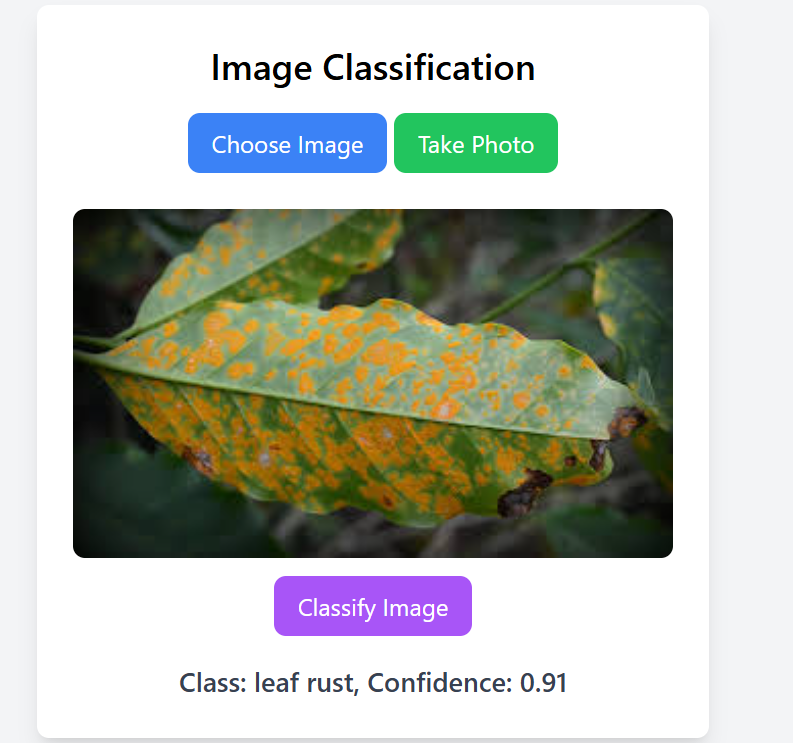

# Coffee Classification

This repository contains a simple flask application that runs a coffee classification model.

To setup:

Clone this repository.

```python
git clone "https://github.com/kizitomayanja/coffee_classification.git"
```

Install dependencies

```python
python -m pip install -r requirements.txt
```

Run Flask server in file `onnx_server.py`

```python
python onnx_server.py
```

View from browser at `localhost:5000`

